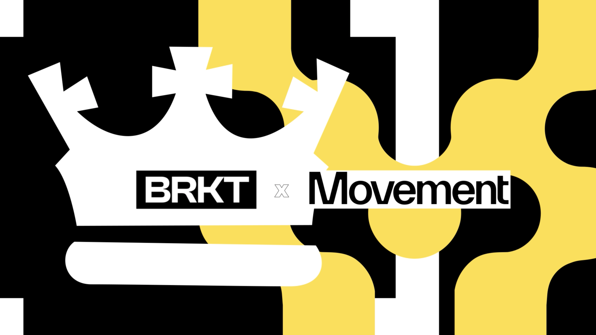

# BRKT 将在Movement网络部署GambleFi，为大众带来新体验

BRKT 是一款由 Google 和 Treasure DAO 的资深人士创建的应用程序，今天宣布将部署在 Movement 上。 BRKT 是一种去中心化的竞赛管理协议。本质上，BRKT 举办括号式锦标赛，并提供实时链上投注结算——以及 Movement 的所有安全性和速度优势。这是什么意思？完全定制的疯狂三月风格的分组锦标赛，无缝举办、投注和奖品分配。

尽管疯狂三月可能是此类锦标赛中最著名的例子，但 BRKT 的灵活性远远超出了这一范围。用户可以创建自己的分组，最多可容纳 256 支球队。他们可以设计足球、美式橄榄球、网球、高尔夫以及任何他们想要的运动的比赛。用户参加对他们有吸引力的锦标赛、下注，并有可能获得奖金。

此外，BRKT 甚至支持体育以外的二元期权投注。用户将能够对诸如两位候选人中哪一位可能赢得选举，或者股票 A 或股票 B 的每周收盘价是否会更高等问题进行下注。

## 体育博彩、GambleFi 和 BRKT 的兴起
近年来，体育博彩已成为一个利润丰厚的行业和文化力量。2023 年，美国人在体育方面的投注额达到创纪录的 1200 亿美元，比 2022 年增长 28%。2024 年第一季度，仅超级碗的投注额就达到 230 亿美元。

现在，体育博彩正在迁移到 Web3。

BRKT 在 GambleFi 的新兴 Web3 类别中开辟了一个新的利基市场——将博彩引入区块链的应用程序。在 Movement 基于以太坊的 M2 上推出 BRKT 使用户能够进行点对点投注，消除了昂贵的中介机构，同时提高了透明度和安全性。

此外，BRKT还提供公平的链上游戏体验。该平台通过其 INVKR 预言机进行保护，可以在链上进行验证。

## Movement中启动的优点
以Movement为基础，BRKT 具有更多优势。 Movement 允许 BRKT 将其以 Solidity 编码的应用程序部署到基于 Move 的链上。这可以通过 Movement 的 Fractal EVM 解释器实现，该解释器创建了与 Movement 的向后兼容性，使以太坊项目能够非常轻松地部署在 Movement Stack 上。此外，Movement 的本地化费用市场和并行执行使 BRKT 的运行速度比任何其他链都快——这是用户体验的必备条件。

Movement 经过精心设计，可提供 GambleFi 和其他 Web3 应用程序安全扩展到数百万用户所需的无摩擦用户体验。

从广义上讲，Movement 使开发人员（和用户）可以轻松地从 Move 中受益， Move 是 Web3 构建者最好、最安全的编程语言。使用其模块化的区块链网络，Movement 还将 EVM 和基于 Move 的世界结合在一起，首次在它们之间创建了完全的可组合性。移动是模块化的，但是是集成的——这意味着由来自许多供应商的优化的模块化区块链元素组成，所有这些元素都是为了安全性、性能和进一步发展特定用例而设计的。

这能为 BRKT 等应用程序解锁什么？更好的安全性。更好的性能。兼容更多框架。获得更多流动性。以及扩展到更多用户的潜力。

## BRKT 和Movement的下一步是什么？
Movement开发网目前已上线。测试网即将推出，主网也将随之推出。为了帮助推动Movement，请加入我们的社区。

BRKT 已完成其第一个测试平台，并将很快部署到 Movement 的测试网。 BRKT 将于 2024 年推出一系列很酷的功能，包括排行榜和私人团体的封闭式分组。

想要注册尝试 BRKT？在BRKT 网站上注册，即将上线。

## 关于BRKT：
BRKT 是一个突破性的去中心化链上竞赛管理协议，它将创建、管理和分配竞赛奖品的权力交到用户手中。我们的平台通过 INVKR Oracle 进行保护，确保现场活动的结果可以在链上得到验证。

## 关于Movement：
Movement 是一个基于 Move 的区块链网络，旨在将智能合约安全性和并行性与 EVM 的流动性和用户基础相结合。M2 是以太坊上第一个 MEVM（Move + EVM）ZK L2，由 Celestia 提供支持，将 MoveVM 与以太坊无缝集成，为区块链互操作性和性能树立了新标准。

## 加入Movement
邀请开发人员、研究人员和区块链爱好者加入 Movement Labs，踏上这一变革之旅。参与开发网络、探索研究论文和博客文章、使用 Movement SDK 进行构建，并沉浸在 Move 编程语言中。

有关Movement实验室的更多信息并浏览文档，请访问Movementlabs.xyz

在Twitter/X
上关注我们加入我们的Discord 和Telegram

原文连接：https://blog.movementlabs.xyz/brkt-brings-gamblefi-to-the-masses-on-movement/
