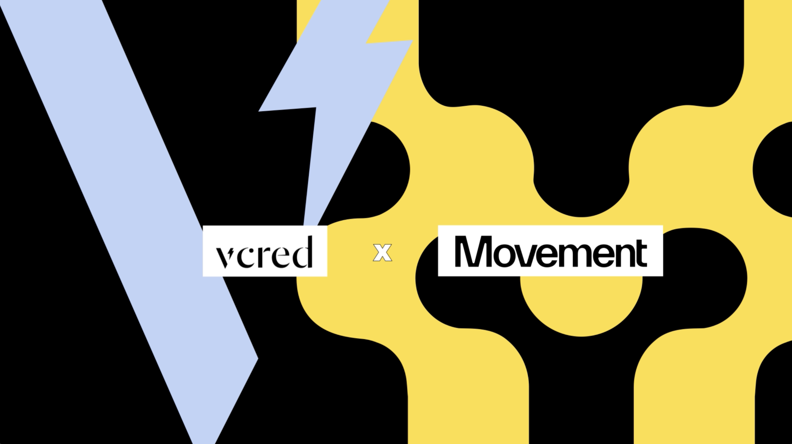

# VCRED 将人工智能与流动性管理相结合

VCRED是一家采用人工智能技术的流动性即服务提供商，已宣布计划在 Movement 上推出。VCRED 位于永续期货交易所之上。
将LP代币存入 VCRED 金库，这些金库经过优化，可为用户提供高效的单边质押。使用先进的人工智能引擎为其金库提供支持以来，VCRED 改进了其复杂的做市策略，并实现了 160 倍的资本效率提升。

流动性是健康 DeFi 生态系统的命脉。VCRED 有可能为流动性管理带来更高的资本效率，这将为 LP、交易员和 Movement 更广泛的 DeFi 生态系统带来福音。最近的 AI 突破使这一切成为可能。

## AI 与 DeFI 的交汇
VCRED 如何提高效率？通过对细粒度的 DeFi 数据进行 AI 训练。

接下来，通过使用人工智能代理为用户提供最佳的单边质押策略。

VCRED 的 AI 引擎使用从各种中央限价订单簿 (CLOB) 和集中流动性做市商 (CLMM) 收集的数据进行微调。然后，AI 代理向已存入金库的 LP 提出建议。利用机器学习和 AI 的力量，VCRED 为 LPS 和去中心化 perp 交易所的用户提供了更多潜在价值。更高的资本效率带来的外部连锁反应包括更顺畅的交易和更强大的 DeFi 生态系统。

## VCRED使用Movement启动的优势
通过在 Movement 上启动，VCRED 获得了实现最佳用户体验所需的所有安全性、速度和性能功能 - 而且不再需要部署自己独立的链。

此外，通过扩展到 Movement，VCRED 首次可以访问非 EVM DEX。这意味着 VCRED 可以访问更多用户和流动性。通过接入以太坊和 Move 流动性，VCRED 可以利用 Movement 独特的深度流动性中心。

这种更大的流动性伴随着 Move 编程语言无与伦比的安全优势，该语言由 Facebook 开发，可在 Web3 中安全、可扩展地使用。

从 EVM 扩展到 Move VM 很容易。使用 Movement 的 Fractal EVM 解释器，尽管 VCRED 是用 Solidity 编写的，但它仍可轻松部署在 Movement 上。使用 Fractal，无需手动将 Solidity 转换为 Move。Fractal 允许 VCRED 以最少的额外工作在 Movement 上启动，从而带来 Move 编程语言的优势并将 VCRED 扩展到 Move VM。

##  采用 VCRED 的优势
VCRED 的资本效率提高了 160 倍，这意味着该平台可以用更少的启动资金做更多的事情，从而可能实现更快的扩展、更严格的滑点容忍度和更大的深度。

VCRED 强大的资本效率意味着他们的 APY 很高，这使得他们成为希望发挥其数字价值的 LP 的明显选择。

## VCRED 和 Movement 的下一步计划是什么？
VCRED 将在未来几个月内在 Movement 测试环境中推出。如需了解有关此次合作以及集成模块化区块链革命的更多信息，请关注 X 上的 Movement Labs。

想要了解更多或试用 VCRED？立即开始吧。

## 关于VCRED
VCRED 旨在成为所有 Perp 和 Spot dexes 的 AI 流动性层。我们的代理提供复杂的做市策略，以增强传统的量化策略。利用团队在 DeFi 方面的专业知识，AI VCRED 协议通过专注于订单簿与 AMM 和 CLMM 提供了一种替代方案。与 Ritual 等去中心化 AI 平台和 BSX 等交易所的合作展示了增长和吸引力。有关更多信息，请关注https://x.com/cred_v。

## 关于Movement：
Movement 是一个基于 Move 的区块链网络，旨在将智能合约安全性和并行性与 EVM 的流动性和用户基础相结合。M2 是以太坊上第一个 MEVM（Move + EVM）ZK L2，由 Celestia 提供支持，将 MoveVM 与以太坊无缝集成，为区块链互操作性和性能树立了新标准。

## 加入Movement
欢迎开发人员、研究人员和区块链爱好者加入 Movement Labs，踏上这一变革之旅。参与开发网络、浏览研究论文和博客文章、使用 Movement SDK 进行构建，并沉浸在 Move 编程语言中。

有关 Movement Labs 的更多信息并浏览文档，请访问movementlabs.xyz

在Twitter/X
上关注我们加入我们的Discord 和Telegram

2024 Movement 版权所有

翻译者：frankeugene
