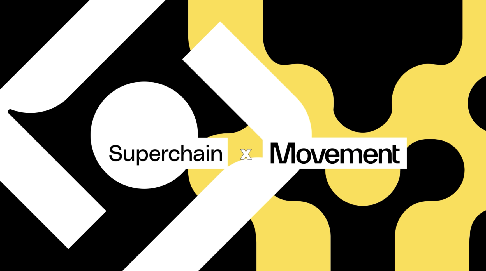

# 超级链为Movement开发人员提供了强大的多链索引器

Movement开发人员已经享有巨大的优势，包括使用 Move 编程语言、Movement SDK 的安全性、效率和经济性以及紧密的社区。现在，开发人员将获得另一个用于构建高性能应用程序的强大工具：Superchain Network。

## 创新的区块链数据产品-Superchain
Superchain Network 是一个沉浸式 Web3 环境，为需要可用、可验证和透明数据进行构建的项目提供数据基础设施。 

Superchain Network 提供下一代数据基础设施，包括比现有解决方案速度更快的索引。

这对于Movement开发者意味着什么？升级您的索引器并获得更好的方法来分析活动和监控合约。

结果：开发人员可以构建更智能、更好的产品。用户可以享受更好的应用程序。

Superchain Network 旨在改变区块链数据思维方式，去中心化其架构。通过分散、将数据统一为一致、精细的模型并在本地进行处理，Superchain 可以提供对快速、低延迟的区块链数据的访问。开发人员可以自定义数据访问级别，根据项目需求进行优化。超级链还具有定制化的数据存储和流媒体能力，进一步加快了数据访问的速度。借助 Superchain，开发人员可以跨 EVM 和 Move VM 获得一致、统一的数据访问。

简而言之，Superhcain 对索引的实用重新构想使 Movement 开发人员能够使用快速、可定制、去中心化的数据进行构建 - 打开了新的大门。

## 下一代Movement开发工具
Superchain 是 Movement 集成但模块化机器中的另一个齿轮。 Movement 战略性地结合了最好的模块化元素，产生了高性能的区块链网络，可以提供将 Web3 应用程序推向全球用户群所需的流畅用户体验。

要了解有关基于 Movement 进行构建以及向Movement开发人员提供的工具包的更多信息，请查看我们最近关于Movement SDK 的解释。深入了解这个专为 M2 Rollup 结构设计的综合开发套件如何结合 Fractal（使以太坊应用程序向后兼容 Movement）和 MoveVM（一种高效的执行引擎，具有严格控制的智能合约环境）等改变游戏规则的功能。

总而言之，Superchain 和许多尖端的 Movement 开发工具代表了区块链范式的转变——朝着更快、更安全、更好的应用程序发展的趋势。

##Superchain 和 Movement的下一步是什么？
很快，您将能够在测试环境中使用 Superchain 在 Movement 上构建应用程序。当我们接近测试网和主网时，Movement建设者将能够加入很酷的新计划，这为我们共同建设未来提供了赢得奖励的机会。要加入Movement，请进入我们的社区。

想了解更多关于Superchain的信息吗？立即加入 Discord并查看下面的其他链接。

## 关于Superchain
Superchain通过使数据可用和可访问，为下一代区块链提供了新型基础设施。 Superchain 成立于 2021 年，其灵感来自于区块链数据的隐私性和去中心化需求。Superchain 网络提供高性能的沉浸式数据流，将非孤立且难以获取的数据点组织成实时和历史流。 Superchain Network 平台确保可验证性、透明度和来源，解决 dApp、链和协议的多个用例。

网址：www.superchain.network

不和谐：https://discord.gg/ScwMTWZqPD

Twitter/X：https://x.com/OpenSuperchain

领英：https://linkedin.com/company/superchain-network

关于Movement
Movement 是一个基于 Move 的区块链网络，旨在将智能合约安全性和并行性与 EVM 的流动性和用户基础相结合。M2 是以太坊上第一个 MEVM（Move + EVM）ZK L2，由 Celestia 提供支持，将 MoveVM 与以太坊无缝集成，为区块链互操作性和性能树立了新标准。

加入Movement
邀请开发人员、研究人员和区块链爱好者加入 Movement Labs，踏上这一变革之旅。参与开发网络、探索研究论文和博客文章、使用 Movement SDK 进行构建，并沉浸在 Move 编程语言中。
有关Movement实验室的更多信息并浏览文档，请访问Movementlabs.xyz

在Twitter/X
上关注我们加入我们的Discord 和Telegram
